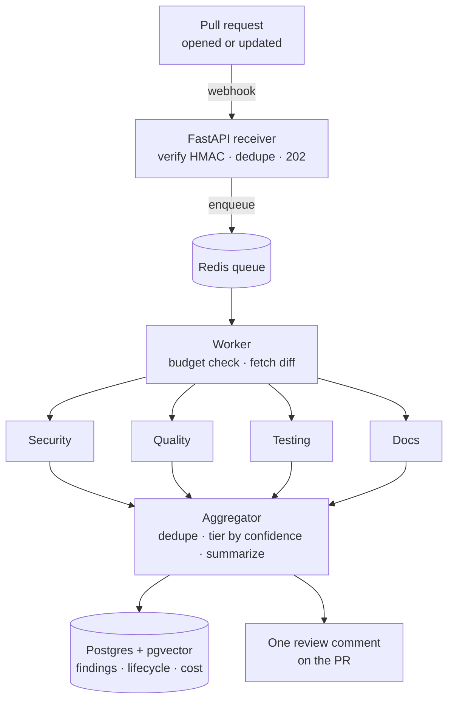
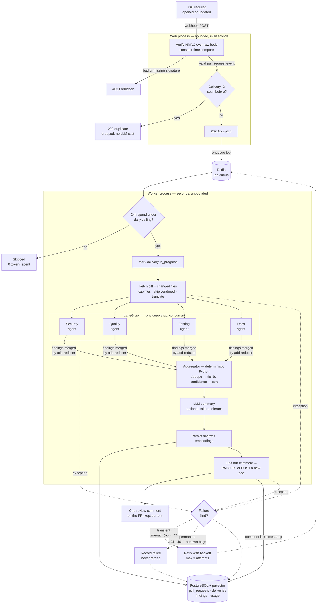

# Multi-Agent PR Reviewer

> An event-driven, multi-agent system that reviews GitHub pull requests the way a senior engineer would — with parallel specialist agents for security, code quality, testing, and documentation.

This is a hands-on study of **production system design for AI agents**: not "an LLM in a loop," but the reliability engineering around it — webhook verification, latency isolation, idempotency, verification gates, and cost control. Load-bearing components are hand-built for understanding; the goal is to learn *why* each production pattern exists, not just to wire one up.

**Status: complete.** All seven phases are built and tested — ingestion, async pipeline, PR fetch, a four-agent graph with deterministic aggregation, a unified Postgres data layer with pgvector search, idempotent posting behind a confidence gate, and observability with tracing, verified cost accounting, bounded retries, and a spend ceiling. Every phase is broken into small, individually tested steps — see the [Build log](#build-log) for the full brick-by-brick decomposition, which doubles as a study map of the project.

---

## How it works

### The shape

One pull request, happy path only — the spine of the system in nine boxes.



### The detail

The same flow with every branch drawn. Solid arrows are the happy path above; dashed arrows are what happens when something fails. The dead ends — rejected signatures, duplicate deliveries, over-budget skips — are half of what the system actually does.



Every LLM call in the shaded worker box is traced to LangSmith, and its token counts are summed into the delivery row — so each review's cost is queryable alongside its findings.

---

## Architecture

The same pipeline as a build map. `✅` = built and tested:

```
GitHub PR opened / updated
   │  webhook (HTTP POST)
   ▼
FastAPI receiver ──► verify HMAC ──► dedupe delivery ──► return 202 fast   ✅
   │  (enqueue job)
   ▼
Redis queue ──► ARQ worker picks up job                                    ✅
   │
   ▼
Budget ceiling check ──► skip before spending if exceeded                  ✅
   │
   ▼
Mark delivery in_progress (Postgres)                                       ✅
   │
   ▼
Fetch PR diff + changed files (GitHub API)                                 ✅
   │
   ▼
LangGraph StateGraph
   ├─ Security agent      ┐                                                ✅
   ├─ Code-quality agent  │                                                ✅
   ├─ Testing agent       │  fan-out (parallel, one superstep)             ✅
   ├─ Docs agent          ┘                                                ✅
   └─ Aggregator ──► fan-in: merge + dedupe + confidence-tier + summary    ✅
   │
   ▼
Persist review — PR, delivery, findings + embeddings + token cost          ✅
   │
   ├──► Semantic search over past findings (pgvector)                      ✅
   ▼
Post one maintained comment to the PR (high-tier findings only)            ✅
   │
   ▼
Record comment id + posted_at                                              ✅

On failure: classify → retry transient with backoff, stop permanent        ✅
Every LLM call traced to LangSmith; usage and cost recorded per delivery    ✅
```

Five ideas carry the design:

- **Fast-ack.** The web process does only fast, bounded work (verify → dedupe → enqueue → `202`) and hands slow LLM work to a separate worker. GitHub times webhooks out, and a blocked request path exhausts the server under concurrent PRs — so the review never runs inline.
- **Fan-out / fan-in.** Four specialist agents read the same PR state and write findings into a shared list; an `operator.add` reducer merges the concurrent writes. A deterministic aggregator then triages those findings (maker ≠ checker) by confidence before anything is surfaced.
- **Durable lifecycle.** Every delivery is recorded in Postgres as `in_progress` *before* the slow work starts, then updated to `done` or `failed`, and finally stamped with the comment it produced. A crashed review leaves a queryable row instead of vanishing.
- **Idempotent side effects.** The same instinct at three layers: `SET NX` on enqueue, `ON CONFLICT` on the PR row, and find-then-update on the GitHub comment. A PR reviewed ten times has one comment, kept current.
- **Bounded failure and bounded spend.** Failures are classified before they are retried, retries are capped and backed off, and a budget ceiling is checked *before* any work — so neither a broken PR nor a runaway loop can spend indefinitely.

---

## Build log

The project is built brick by brick — each step is implemented and tested in isolation (happy path *and* failure path) before the next. This section is the full decomposition; it's meant to be read as a study map of how the system was assembled.

### Phase 1 — Webhook ingestion ✅
*Files: `app/main.py`, `scripts/send_test_webhook.py`*

- **1a — Receiver + verification.** FastAPI `/webhook` endpoint: HMAC-SHA256 verification over the *raw* request body (constant-time compare), event/action filtering (`pull_request`; `opened`/`synchronize`/`reopened`), fast `202` acknowledgement.
- **1b — Local test harness.** Signs payloads and exercises the security gate three ways: valid → `202`, tampered body → `403`, missing signature → `403`.

### Phase 2 — Async pipeline ✅
*Files: `docker-compose.yml`, `app/queue.py`, `app/worker.py`, `app/main.py`*

- **2a — Stand up Redis.** Redis via Docker Compose; a shared `RedisSettings` (`app/queue.py`); reachability proven with `redis-cli ping` → `PONG`.
- **2b — Enqueue + consume.** The web process enqueues onto Redis via a lifespan-managed ARQ pool; idempotent dedupe using `SET NX` on the `X-GitHub-Delivery` ID; a separate ARQ worker consumes `review_pr`. Proven: a job crosses the process boundary; a duplicate delivery ID is dropped before it enqueues.

### Phase 3 — PR context fetch ✅
*Files: `app/config.py`, `app/github_client.py`, `scripts/test_github_client.py`, `app/worker.py`, `.env.example`*

- **3a — Centralized config.** `pydantic-settings` + `.env` as a single source of truth; typed, validated settings; optional per-process secrets; fail-fast at boot for required values. `.env.example` documents required config.
- **3b — GitHub API client.** Fetches PR metadata + changed files; a deliberate *diff budget* (cap file count, skip generated/vendored paths, truncate oversized patches); typed error handling (`401`/`403`/`404`/rate-limit → `GitHubError`). Tested in isolation against a real PR, plus a `404` failure path.
- **3c — Wire into the worker.** `review_pr` calls `GitHubClient().fetch_pr()`, catches `GitHubError`, and re-raises so ARQ marks the job failed rather than swallowing it. Proven end to end: webhook → queue → worker → live GitHub fetch.

### Phase 4 — Multi-agent graph ✅
*Files: `app/graph.py`, `scripts/test_agent.py`, `scripts/test_graph.py`*

- **4a — Single agent, end to end ✅**
  - **4a-1 — Config.** Add `ANTHROPIC_API_KEY` (optional per-process secret); install `langgraph` + `langchain-anthropic`.
  - **4a-2 — State + Finding model.** Graph state (`PRState`) and a Pydantic `Finding` (file / line / category / severity / confidence / message). `findings` uses an `Annotated[list, add]` reducer so parallel writes merge instead of overwrite; an `AgentResponse` wrapper enables list-valued structured output.
  - **4a-3 — Security agent node.** Claude via `ChatAnthropic().with_structured_output()`; a prompt that demands honest confidence and an empty list on a clean PR; the node force-stamps `category="security"` rather than trusting the model to self-label. Tested both ways: benign PR → 0 findings, planted-secret PR → caught with high confidence.
  - **4a-4 — Assemble + invoke.** Compile the review graph (`START → security → END`) once at import; invoke it from the worker after the fetch. Proven end to end: webhook → queue → fetch → graph → Claude → structured findings.
- **4b — Fan-out to specialists ✅**
  - **4b-1 — Agent factory + three specialists.** Refactor the hand-written security node into a `make_agent(name, category, prompt)` factory; add quality, testing, and docs agents from the same machinery with a shared confidence rubric. Proven: security behaves identically post-refactor, and quality correctly stays silent on a security-only diff (domain separation works).
  - **4b-2 — Fan-out / fan-in graph.** All four agents wired from `START` so they run concurrently in one superstep; their `findings` writes merge through the reducer instead of colliding. Proven: a merged list containing findings from multiple agents in a single run.
  - **4b-3 — Aggregator node.** All four agents converge on an `aggregate` node (a synchronization barrier — it can't run until every agent finishes). Deterministic Python does the deciding: dedupe by (file, line, category), tier by confidence (`high` ≥ 0.7, `low` ≥ 0.3, below that dropped as noise), sort by severity then confidence. An **optional** LLM summary narrates the survivors, wrapped in a try/except so a failed summary can't break the computed result.

### Phase 5 — Unified data layer ✅
*Files: `db/schema.sql`, `db/migrations/001_add_embeddings.sql`, `app/db.py`, `app/embeddings.py`, `scripts/search_findings.py`*

- **5a — Stand up Postgres ✅.** Local-first Postgres via the `pgvector/pgvector:pg17` image in Docker Compose, with a named volume so data survives restarts; `DATABASE_URL` added to `Settings` with a working local default; `asyncpg` as the driver. Proven: `SELECT version()` connects, and `CREATE EXTENSION vector` + `'[1,2,3]'::vector` confirms pgvector is available.
- **5b — Schema ✅.** Three tables with an explicit relational model: `pull_requests (1) ──< deliveries (1) ──< findings`. A finding belongs to a *delivery* (one review run), not directly to a PR, so each run's results stay a distinct snapshot. Foreign keys enforce integrity, `ON DELETE CASCADE` keeps findings from orphaning, `UNIQUE (repo, pr_number)` enables the PR upsert, and `UNIQUE (delivery_id)` anchors dedupe. Idempotent, so re-applying is safe.
- **5c — Persistence layer ✅.** `app/db.py` with a lazily-created `asyncpg` connection pool, opened once via ARQ's `on_startup` hook and closed on shutdown. `save_review()` writes PR → delivery → findings inside a single transaction, threading generated keys through with `RETURNING id`; the PR insert is an upsert. Proven: a three-table join returns a complete review written by a separate process, and a second review adds a second delivery row while the PR count stays at 1.
- **5d — Delivery lifecycle ✅.** The status machine moves into Postgres: `mark_in_progress()` records the delivery *before* any slow work, `save_review()` flips it to `done`, and failures record the reason. Redis `SET NX` stays as the cheap request-path check; Postgres is the durable authority. Proven both ways: a successful run ends `done`, and a deliberate 404 leaves a queryable `failed` row with the error — the state that was previously invisible. This closes the Phase-2 dedupe gap.
- **5e — pgvector semantic search ✅.** A migration adds a `vector(384)` column to `findings` plus an HNSW index under cosine distance. `app/embeddings.py` embeds locally with `fastembed` (`BAAI/bge-small-en-v1.5`), model loaded once per process via `lru_cache`; findings are embedded in one batched call inside `save_review`. `search_similar_findings()` joins vector similarity (`<=>`) straight onto the relational tables, so one query returns similar findings *and* which PR each came from. Proven semantically, not lexically: the query "credentials leaked into version control" — sharing almost no words with the stored text — matched the hardcoded-secret findings at distance **0.268**, while an off-topic query ("slow database query performance") scored **0.488** against the same rows.

### Phase 6 — Results + approval gate ✅
*Files: `app/github_client.py`, `app/render.py`, `db/migrations/002_add_posted.sql`*

- **6a — GitHub write client ✅.** The token is escalated from read-only to `Pull requests: Read and write` — a deliberate, minimal privilege increase (Contents stays read-only, so the reviewer still cannot touch code). A generic `_request` helper adds POST/PATCH alongside the existing reads, plus `find_our_comment` / `post_comment` / `update_comment`.
- **6b — Comment rendering + the gate ✅.** `app/render.py` builds the comment body: the aggregator's summary, then **high-tier findings in full detail**, then a bare *count* of demoted findings. The confidence tier from 4b-3 stops being bookkeeping and becomes a gate on what a human actually sees — low-confidence findings stay in Postgres, queryable, and never reach the PR.
- **6c — Idempotent posting ✅.** An invisible HTML marker (`<!-- multi-agent-pr-reviewer -->`) is embedded in the body; before posting, the client lists PR comments and looks for it. Found → `PATCH` the existing comment; not found → `POST` a new one. Proven: a second review of the same PR issued a `PATCH` against the same comment id rather than stacking a duplicate. A reviewer that comments on every push gets muted; one that maintains a single current comment gets read.
- **6d — Record what reached GitHub ✅.** A migration adds `comment_id` and `posted_at` to `deliveries`, set by `mark_posted()` after a successful post. "Review computed" and "review visible to a human" become distinguishable states — a distinction the database previously could not express.

### Phase 7 — Observability & cost ✅
*Files: `app/config.py`, `app/worker.py`, `app/graph.py`, `app/db.py`, `db/migrations/003_add_usage.sql`, `db/migrations/004_add_retry.sql`*

- **7a — LangSmith tracing ✅.** Three settings loaded through `Settings` and exported into `os.environ` in the worker's startup hook — a deliberate bridge, since LangSmith reads the process environment while `.env` only populates the settings object. Tracing is **off by default** and opt-in. What the traces make visible: the four agent spans overlap in a single superstep (8.0s of agent work completing inside a 5.6s trace — the fan-out proven from timings, not asserted), each node's exact prompt and structured output, and per-call token counts.
- **7b — Token usage and cost accounting ✅.** `usage` added to the graph state with the **same `add` reducer** as `findings`, so the four parallel agents' token records merge automatically — one primitive, two uses. Agents switch to `with_structured_output(..., include_raw=True)` so the raw message (and its `usage_metadata`) survives alongside the parsed findings. A migration adds `input_tokens`, `output_tokens`, `cost_usd`, and a JSONB `usage_detail` (per-node breakdown) to `deliveries`. **Verified against LangSmith:** tokens matched exactly (5,552), and the first cost figure did *not* — the hardcoded price constants were for the wrong Sonnet generation, inflating cost by ~50%. Corrected to Sonnet 5's $2/$10 per MTok, after which both agreed ($0.0154 vs $0.0155). Cost history now outlives LangSmith's 14-day retention and can be joined against findings.
- **7c — Retry with guardrails ✅.** `classify_failure()` sorts exceptions into *transient* (timeouts, connection errors, `429`, upstream `5xx`) and *permanent* (`404`, `401`, and — by default — anything unrecognized, including our own bugs). Transient failures retry with exponential backoff up to three attempts; permanent ones never retry. `retry_count`, `last_error`, and `failure_kind` are recorded per delivery. Proven both ways: a 404 stopped at **attempt 1** with `failure_kind='permanent'`, while a simulated `ConnectError` retried with growing delays and gave up at **attempt 3**.
- **7d — Budget ceiling ✅.** `spend_since(24)` sums `cost_usd` over a rolling window; if it exceeds `DAILY_BUDGET_USD`, the review is skipped **before** `mark_in_progress` and before any API call. Proven by lowering the ceiling below the day's spend: the job returned `{'skipped': 'budget'}` in **0.05s having spent zero tokens**, then ran normally in 9.05s once the ceiling was restored.

---

## Tech stack

- Python 3.12
- FastAPI + Uvicorn (webhook receiver)
- Redis + ARQ (queue and async worker)
- PostgreSQL 17 + `pgvector`, via `asyncpg` with hand-written SQL (data layer)
- `fastembed` (local ONNX embeddings, 384-dim)
- `pydantic-settings` (centralized config), `httpx` (GitHub API client)
- LangGraph + `langchain-anthropic`, Claude Sonnet 5 via the Anthropic API (agent graph)
- LangSmith (tracing / observability)
- Docker / Docker Compose (local Redis + Postgres)

---

## Getting started

### Prerequisites
- Python 3.12
- Docker Desktop (running)
- A GitHub fine-grained PAT with **read** access to Contents and **read/write** access to Pull requests
- An **Anthropic API key** (workspace-scoped)
- Optional: a **LangSmith API key** for tracing

### Setup

```bash
git clone https://github.com/Colin-J-Emmanuel/multi-agent-pr-reviewer.git
cd multi-agent-pr-reviewer

python -m venv .venv
source .venv/bin/activate        # Windows: .venv\Scripts\activate
pip install -r requirements.txt

cp .env.example .env             # then fill in the values below
```

Config lives in `.env` (never committed):

| Variable | Purpose |
|----------|---------|
| `GITHUB_WEBHOOK_SECRET` | Shared secret set on the GitHub webhook; used for HMAC verification |
| `GITHUB_TOKEN` | Fine-grained PAT (read: contents; read/write: pull requests) |
| `ANTHROPIC_API_KEY` | Workspace-scoped Anthropic key; the worker uses it to call Claude |
| `DATABASE_URL` | Defaults to the local Compose Postgres |
| `REDIS_URL` | Defaults to `redis://localhost:6379` |
| `DAILY_BUDGET_USD` | Rolling 24h spend ceiling; `0` disables the check (default `5.00`) |
| `LANGSMITH_TRACING` | Optional; `true` to enable tracing (defaults off) |
| `LANGSMITH_API_KEY` | Optional; required only when tracing is on |
| `LANGSMITH_PROJECT` | Optional; trace project name |

### Run it

Start the infrastructure, apply the schema and migrations, then run the two app processes (venv active, from the repo root — config loads from `.env`):

```bash
docker compose up -d                 # 1. Redis + Postgres

for f in db/schema.sql db/migrations/*.sql; do
  docker exec -i pr-reviewer-postgres psql -U pruser -d prreviewer < "$f"
done

uvicorn app.main:app --reload        # 2. Web receiver
arq app.worker.WorkerSettings        # 3. Worker (separate terminal)
```

All SQL is idempotent — re-running it is safe. The first review downloads the embedding model (~70 MB), once per machine. Note the worker does **not** hot-reload: restart it after changing any `app/` module.

### Test it

The HMAC gate, no GitHub or tunnel required (the harness holds the secret itself, standing in for GitHub):

```bash
GITHUB_WEBHOOK_SECRET=<your-secret> python scripts/send_test_webhook.py
```

Expected:

```
valid            -> 202 {"status":"accepted","delivery_id":"test-delivery-001"}
tampered         -> 403 {"detail":"Invalid signature"}
no-signature     -> 403 {"detail":"Missing signature"}
```

Send it again without changing the delivery ID and `valid` becomes `202 duplicate` (idempotency). Reset the dedupe key with `docker exec -it pr-reviewer-redis redis-cli FLUSHALL`.

Component tests (each exercises one piece in isolation against a real PR):

```bash
python -m scripts.test_github_client <owner/repo> <pr_number>            # PR fetch
python -m scripts.test_agent <agent> <owner/repo> <pr_number>            # one agent
python -m scripts.test_graph <owner/repo> <pr_number>                    # full graph + aggregator
python -m scripts.search_findings "<natural language query>"             # semantic search
```

Inspect what was persisted:

```bash
# Findings, joined back to their delivery and PR
docker exec -it pr-reviewer-postgres psql -U pruser -d prreviewer -P pager=off -c \
  "SELECT pr.repo, pr.pr_number, d.delivery_id, d.status, f.category, f.severity, f.confidence, f.tier
     FROM findings f
     JOIN deliveries d ON f.delivery_id = d.id
     JOIN pull_requests pr ON d.pull_request_id = pr.id;"

# What's broken, and was it worth retrying?
docker exec -it pr-reviewer-postgres psql -U pruser -d prreviewer -P pager=off -c \
  "SELECT delivery_id, status, failure_kind, retry_count, left(last_error, 60)
     FROM deliveries WHERE status <> 'done' ORDER BY id;"

# What did each review cost, and did it reach GitHub?
docker exec -it pr-reviewer-postgres psql -U pruser -d prreviewer -P pager=off -c \
  "SELECT delivery_id, input_tokens, output_tokens, cost_usd, posted_at IS NOT NULL AS posted
     FROM deliveries ORDER BY id;"
```

---

## Design decisions

The choices worth explaining, and why they were made:

- **Verify HMAC over the raw request body, in constant time.** The signature covers the exact bytes GitHub sent, so the body must be read before JSON parsing (re-serializing changes the bytes and breaks the match). Comparison uses `hmac.compare_digest`, not `==`, to avoid leaking timing information an attacker could use to forge a signature.
- **Fast-ack, then queue.** The webhook handler never does LLM work. It verifies, enqueues, and returns `202` in milliseconds; a separate worker does the slow review. This is latency isolation — it keeps the request path bounded and prevents thread-pool exhaustion under load.
- **Idempotent enqueue via `SET NX`.** GitHub retries and can redeliver. Each delivery carries a unique ID; recording it with `SET NX` means a duplicate delivery is dropped before it costs an LLM call.
- **Centralized, validated config with per-process secrets.** One `pydantic-settings` source of truth. Secrets are optional at the type level and required only where used, so the web receiver boots without a model key while the worker fails with a clear message if its key is missing — the right secret needed by the right process, validated fail-fast. Optional features default to **off**, so a fresh clone runs with the minimum configured.
- **A diff budget in the GitHub client.** File-count cap, skip lists for generated/vendored files, and patch truncation decide *what the reviewer pays attention to*. A naive "review everything" falls over on large PRs (cost, latency, noise); the budget keeps it bounded. The measured ~5.5K tokens per review is for a two-line diff — each agent receives the full diff, so input cost scales four times over without the budget.
- **Structured LLM output for findings.** `with_structured_output()` + a Pydantic `Finding` returns typed, validated objects (`confidence` constrained to `[0,1]`) instead of prose to parse — "computed, not narrated." Each node also force-stamps its own category rather than trusting the model to self-label.
- **A reducer on `findings`.** `Annotated[list, operator.add]` merges the four agents' concurrent writes instead of letting the last one overwrite the rest. Without it, LangGraph rejects concurrent writes to the same key outright — the reducer is what makes the fan-out possible at all. The same primitive later merged per-agent token usage with no modification.
- **A deterministic aggregator with an optional LLM summary.** The part that *decides* — dedupe, confidence tiering, ordering — is plain Python that can be read and tested; it cannot hallucinate a finding into or out of existence. The LLM only *narrates* the survivors, and its failure is caught so it can never break the computed result. Gates are computed, not narrated. (Measured: the summary is ~9% of token spend; the decision-making is free.)
- **Keep low-confidence findings, demoted rather than dropped.** An agent's low confidence describes its own certainty, not the issue's importance. Demoting preserves the finding in the record instead of silently discarding something that might matter — and Phase 6 turns that tier into a real gate: high-tier findings are posted to the PR, demoted ones stay in the database.
- **One maintained comment, not one per push.** The reviewer embeds an invisible marker in its comment and updates that comment on subsequent reviews. A bot that posts a fresh comment on every push is muted within a day; one that keeps a single comment current stays useful. This is the same idempotency instinct as `SET NX` and `ON CONFLICT`, applied to a side effect on someone else's system.
- **Findings belong to a delivery, not a PR.** A PR is reviewed many times over its life; tying findings to the delivery keeps each review run as a distinct, queryable snapshot. "All findings for this PR" is still one join away.
- **Write the delivery row before the work, not after.** Recording `in_progress` up front is what makes a crashed review *visible* — a stale `in_progress` row is, by definition, a job that started and never finished. Writing only on success would leave failures indistinguishable from events that never arrived.
- **Redis for the fast path, Postgres for the authority.** The request-path dedupe stays an in-memory `SET NX` because it must be cheap; durable lifecycle state lives in Postgres because it must survive a crash. Right tool in each place.
- **One transaction per review.** PR, delivery, and findings are inserted atomically, so a process death mid-write can't leave a delivery with half its findings.
- **Parameterized SQL throughout.** Values are passed separately from the query text (`$1, $2, …`), never interpolated — SQL injection is structurally impossible rather than merely avoided.
- **Least privilege on the GitHub token, escalated deliberately.** Read-only through Phase 5; raised to `Pull requests: write` only when posting required it, with Contents left read-only. The blast radius stays describable in one sentence: a leaked token could comment on PRs in one repo and could not modify a line of code.
- **Local-first Postgres.** Postgres is Postgres; the schema, async SQL, transactions, and pgvector work identically hosted or local, and swapping to a managed service is a one-line `DATABASE_URL` change. Running locally keeps the repo clone-and-run with no external account.
- **Local embeddings over a hosted embedder.** `fastembed` runs ONNX locally: no additional API key, no per-finding cost, and it keeps the "clone and run" property. The trade-off is coupling — the model's 384 dimensions are fixed in the `vector(384)` column, so changing embedding models means a migration and a re-embed.
- **Vector search lives beside the relational data.** Similarity is a `<=>` ordering in the same SQL that joins `findings → deliveries → pull_requests`. No separate vector store to sync, and no two-system join stitched together in application code — the point of a unified data layer.
- **Cost accounting in our own database, cross-checked against a second source.** LangSmith already reports cost, but its traces expire after 14 days and can't be joined against findings. Recording usage in Postgres makes spend history durable and queryable — and comparing the two exposed a real 50% error in the price constants that no amount of self-inspection would have caught.
- **Classify failures before retrying, and default to "permanent."** Retrying a `404` or a `TypeError` cannot succeed; it only burns money. Unrecognized exceptions are treated as permanent precisely because our own bugs fail identically every time — the conservative default means a mistake costs one lost review rather than an unbounded loop. Retry is capped and backed off on top of that.
- **Check the budget before the work, not after.** A ceiling evaluated after the LLM calls is an accounting note, not a control. Checking before `mark_in_progress` means an over-budget delivery costs one cheap SQL query and nothing else.
- **Separate, single-purpose processes.** Receiver and worker are distinct so they can fail, scale, and be reasoned about independently.
- **Pinned dependencies + Dependabot.** `requirements.txt` pins exact versions for reproducible builds; Dependabot opens grouped bump PRs so pins don't rot.

### Known gaps (deliberately deferred)

- **The budget ceiling is soft.** It is checked per review, so concurrent workers could each pass the check and collectively overshoot, and a single expensive review already in flight cannot be halted. The blast radius is bounded to roughly one review's overshoot; a hard cap would need per-call accounting inside the graph.
- **A budget skip leaves no delivery row.** Because the check runs before `mark_in_progress`, a skipped review is visible in the logs but not queryable in Postgres — the one lifecycle state that isn't durable.
- **Price constants are hardcoded and unvalidated.** `PRICE_INPUT_PER_M` / `PRICE_OUTPUT_PER_M` are pinned to Claude Sonnet 5 at a point in time, with nothing checking them at runtime. When they were wrong, the `cost_usd` column was silently wrong by ~50% while looking authoritative — only an external cross-check revealed it. Changing `MODEL` means revisiting them.
- **A failed post marks the whole delivery failed.** Posting sits inside the review's `try`, so a review that computed, persisted, and posted correctly but failed on the final bookkeeping write is recorded as `failed`. Honest, but coarse: "review succeeded, side effect failed" is not yet its own state.
- **Findings predating Phase 5e have no embeddings** and are invisible to semantic search; there is no backfill script yet. Related smell: because the search filters on `embedding IS NOT NULL`, "nothing has been embedded" and "no similar findings" return the same empty result.
- **Embedding happens inside the review transaction.** A slow model load or embed call holds the database transaction open. Invisible at this volume; would move outside the transaction (or into a background step) if throughput mattered.
- **The noise floor is untested.** No finding has yet come back below `confidence < 0.3`, so the drop branch in the aggregator has never executed in practice.
- **Model/client constructed per call.** `GitHubClient` and `ChatAnthropic` are built fresh on each job (no connection reuse). Invisible at this volume; would be hoisted into worker startup if throughput ever mattered. The Postgres pool and the embedding model, by contrast, *are* loaded once and reused.

---

## Acknowledgments

Architecture inspired by the freeCodeCamp course *"Learn System Design for AI Agents: Build a Production-Ready Multi-Agent PR Reviewer"* by Ayush Singh. Implementation and design decisions are my own.

## License

© 2026 Colin Emmanuel. All rights reserved. This is a personal learning project and is not licensed for reuse.

## Author

Colin Emmanuel — [@Colin-J-Emmanuel](https://github.com/Colin-J-Emmanuel) · c.j.emmanuel@columbia.edu